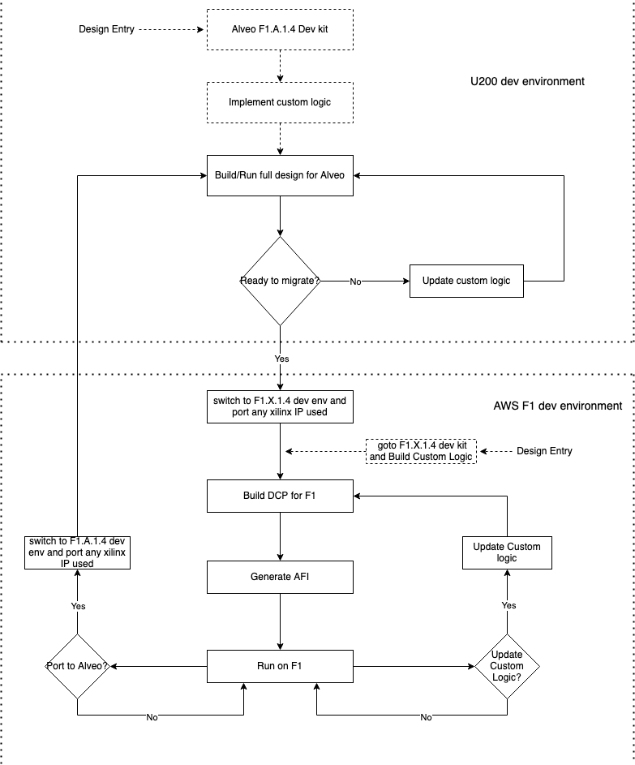

# Table of Contents

1. [Overview](#Overview)
1. [F1.A.1.4 shell](#F1.A.1.4-shell)
1. [Development Flow](#Development-Flow)
1. [Development migration between Alveo Shell and F1 shell](#Development-migration)
     - [Development for Alveo U200 using F1.A.1.4 shell](#Development-for-U200)
     - [Migration to F1](#Migration-to-F1)

# Overview 

F1 customers want to seamlessly migrate between Alveo and F1 platforms to enable scaling in AWS cloud. 
The F1 development flow currently supports the requirement with [Vitis](https://github.com/aws/aws-fpga/blob/master/Vitis/docs/Alveo_to_AWS_F1_Migration.md), but there is no such support available for full custom RTL development flow (Vivado design flow). 
AWS F1.A.1.4 shell is targetted at enabling this.

# F1.A.1.4 shell 

AWS F1.A.1.4 shell enables customers to migrate designs seamlessly between on-premise U200 Alveo card and F1 platform in a full custom RTL development flow. This gives choice to the customers to use either a Vitis flow or a full custom RTL/Vivado design flow and seamlessly migrate designs between Alveo U200 and F1. The F1.A.1.4 shell for Alveo U200 is fully compatible with F1.X.1.4 shell thus making the migration as simple as swapping the shell with one another, with no design changes to user logic. Xilinx device,  xcu200-fsgd2104-2-e (Part used in U200) is based on VU9P and has the same base SLR die with the same number of SLRs as VU9P (F1 device) and is therefore highly compatible with F1 implementation.

The F1.A.1.4 shell is fully interface compatible and footprint compatible with F1.X.1.4 and no changes to custom logic design are required. Similar to the existing F1 shells, the F1.A.1.4 shell provides all the required communication interfaces to the custom logic. This helps our customers with the effort required to implement their own interfaces for Alveo U200 platform and also provides them with a seamless migration path to F1 in the custom RTL development flow. The F1.A.1.4 shell does not support partial reconfiguration/DFX. Dynamic clock configuration, VDIP/VLED are controlled via registers in PF1-B0 in F1.A.1.4 shell, using tools provided in the developer kit. SW APIs supported by F1.X.1.4 shell are not available/compatible with F1.A.1.4 shell.

# Development Flow 
The F1 provided F1.A.1.4 shell based Vivado design flow will have the shell provided as dcp and the associated developer kit (including examples, build scripts, constraints) provided through xilinx website as a tar file and also through github, along with Readme/Tutorial documents for use in Alveo development environment. The developer kit will also include examples to help customers get started with development in Alveo Vivado design flow using F1 provided Alveo shell.

Developers can download/clone the F1.A.1.4 development kit on their development environment and get started with the development. Xilinx tool version 2021.2 or above is required. The developer kit is structured very similar to the F1 FPGA developer kit. cl_hello_world and cl_dram_dma examples from F1 environment are ported to F1.A.1.4 shell and are provided with associated simulation and test environment. Customers are encouraged to run the examples to get familiarized with the development flow.

The developer flow using F1.A.1.4 shell is maintained to resemble the current F1 development flow and thus a seamless portability is established with F1 development as shown in Figure1.

figure1: Flow chart for design portability between Alveo and F1 development environment

Customer can start with either Alveo development environment or the F1 environment and work on their CL design/development. Once they are ready to migrate to the other environment, they need to clone the other developer environment, copy their custom rtl files and port any xilinx ip used to the new environment and get started with the build flow. Since the interface compatibility is maintained between the shells, no changes to the CL is required.

*Note*: Customers are required to port the Xilinx IP used in their designs from one environment to the other during migration. For ddr4 controller IP used in the design, customers are not required to port the IP. Instead, the ddr4_core IP and the sh_ddr provided in the corresponding development environment should be used and the build scripts (synth_example.tcl) should point to the corresponding IP used.

# Development migration between Alveo Shell and F1 shell 

## Development for Alveo U200 using F1.A.1.4 shell 
*STEP1*:
The customers will clone the dev kit using

    git clone https://github.com/aws/aws-fpga-f1-u200.git

They can also simply download the dev kit provided as tar ball from xilinx Alveo Vivado flow [webpage](https://www.xilinx.com/products/boards-and-kits/alveo/u200.html#gettingStarted).

*STEP2*:

setup the software development environment

	source sdk_setup.sh
	cd sdk
	sudo ./sdk_install.sh

*STEP3*:

Install the patched xdma driver according to instructions in $ROOT/sdk/xdma_patch/xdma_install.md

*STEP4*:
source the development setup through hdk_setup.sh

    source hdk_setup.sh

The hdk_setup.sh script sets up all the required environment for Alveo U200 development using F1 based Alveo F1.A.1.4 shell. It points to the vivado installation, checks for supported version of vivado tool for compatibility, sets up key environment variables and downloads F1.A.1.4 shell dcp. In addition, it also prepares any required patches for tool and IP blocks.

*STEP5*:
After setting up the development environment, in order to build cl_dram_dma example provided, run the following steps

    $ cd $HDK_DIR/cl/examples/cl_dram_dma
    $ export CL_DIR=$(pwd)
    $ cd $CL_DIR/build/scripts
    $ ./aws_build_bit_from_cl.sh

The above steps generate a bit file in the $CL_DIR/build/bitstreams directory along with associated reports in $CL_DIR/build/reports directory. This bit file can be programmed on an on-prem Alveo U200 card using physical JTAG cables.

In order to build a custom design, copy the example directory to $HDK_DIR/cl/developer_designs and update CL_DIR environment variable to point to the new design

    $ cd $HDK_DIR/cl/developer_designs
    $ cp -r $HDK_DIR/cl/examples/<example> .
    $ export CL_DIR=$(pwd)

The developer_designs directory also comes with a prepare_new_cl.sh script to set up the directory structure from scratch, as required by HDK simulation and build scripts. Also modify the build scripts for timing, clock and placement constraints and point to corresponding source files and IP and run the aws_build_bit_from_cl.sh script to generate corresponding bit file for U200.

Each CL example comes with a runtime software under $CL_DIR/software/runtime/ subdirectory. You will need to build the runtime application that matches your build.

    $ cd $CL_DIR/software/runtime/
    $ make all
    
Before running the compiled c code for any build, setup the pcie regs
    
    $ setpci -v -s 0000:c1:00.0 0x4.w=0x7
    $ setpci -v -s 0000:c1:00.1 0x4.w=0x7
    
Then run

    $ sudo ./test_hello_world

## Migration to F1 
Customers are encouraged to get familiar with F1 development environment before building their custom logic for F1 using various examples provided as part of F1 developer kit. For further instructions, on getting started with F1 developer kit, please refer to getting started [documentation](https://github.com/aws/aws-fpga/blob/master/hdk/README.md) provided with aws-fpga developer kit

When ready for migration to F1, customers create an aws account and launch an instance type of interest, as described in https://github.com/aws/aws-fpga/blob/master/hdk/README.md

After creating the aws instance, clone the F1 developer kit using

    $ git clone https://github.com/aws/aws-fpga.git $AWS_FPGA_REPO_DIR

Customers can set up their custom logic in place of the examples provided using the instructions provided [here](https://github.com/aws/aws-fpga/blob/master/hdk/cl/developer_designs/Starting_Your_Own_CL.md). 
To port the customer logic design from F1 based Alveo U200 development environment to F1 development environment, customers need to port three sets of design and build files:

1.) *custom RTL files* (e.g: .sv or .v files): No changes are required in Custom Logic RTL files. Customers can simply copy all the custom RTL files from U200 to F1 dev environment

    e.g: cp -r <U200>/design/* <F1>/design/

2.) *Xilinx IP*: Customers are required to port the Xilinx IP used in their designs from one environment to the other during migration. 
*Note:* For ddr4 controller IP used in the design, customers are not required to port the IP. Instead, the ddr4_core IP and the sh_ddr provided in the corresponding development environment should be used.

3.) *Build scripts*: Update the associated build scripts (synth_<design>.tcl) to point to the correct IP files. Also modify the build scripts for F1 for appropriate timing constraints and source file list.

Once the RTL files are copied, IPs ported and scripts updated; standard F1 development flow can be used to build the ported design in F1 Development environment can be used to build the design seamlessly for F1 platform as described [here](https://github.com/aws/aws-fpga/blob/master/hdk/cl/developer_designs/Starting_Your_Own_CL.md)

source the hdk_setup script using

    $ cd $AWS_FPGA_REPO_DIR
    $ source hdk_setup.sh

 After the set up, a dcp is built from cl using

    $ cd $CL_DIR/build/scripts
    $ ./aws_build_dcp_from_cl.sh

Once the dcp is generated, it is submitted for ingestion to generate AFI for running on F1

    $ aws ec2 create-fpga-image \
        --region <region> \
        --name <afi-name> \
        --description <afi-description> \
        --input-storage-location Bucket=<dcp-bucket-name>,Key=<path-to-tarball> \
        --logs-storage-location Bucket=<logs-bucket-name>,Key=<path-to-logs> \
    [ --client-token <value> ] \
    [ --dry-run | --no-dry-run ]

Instructions for the F1 flow can be found on git documentation, provided as part of F1 developer kit [here](https://github.com/aws/aws-fpga/blob/master/hdk/README.md).
