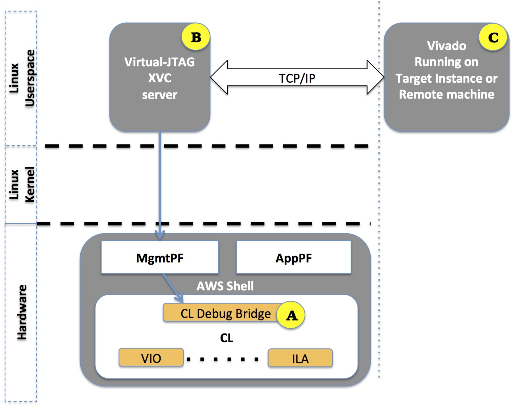

# Virtual JTAG for Real-time FPGA Debug

## Table of Contents

1. [Overview](#overview)
2. [Enabling Debug on FPGA-enabled EC2 Instance, using XVC](#startVJtag)
3. [Connecting Xilinx Hardware Manager(Vivado Lab Edition) running on local F1 instance to the Debug Target FPGA-enabled EC2 Instance](#connectToTargetLocally)
4. [Connecting Xilinx Hardware Manager(Vivado Lab Edition) running on remote machine to the Debug Target FPGA-enabled EC2 Instance](#connectToTargetRemotely)
5. [Embedding Debug Cores in CL/AFI](#embeddingDebugCores)
6. [Frequently Asked Questions](#faq)


<a name="overview"></a>
# Overview

F1-Alveo Compatible Shell supports Virtual JTAG capability by emulating JTAG over PCIe using Xilinx Virtual Cable (XVC) protocol. The XVC protocol allows (local or remote) Vivado to connect to a target FPGA for debug leveraging standard
Xilinx standard debug cores like
[Integrated Logic Analyzer - ILA](https://www.xilinx.com/products/intellectual-property/ila.html),
[Virtual Input/Output - VIO](https://www.xilinx.com/products/intellectual-property/vio.html), and others.

Traditionally, a physical JTAG connection is used to debug FPGAs.  F1-Alveo Shell, similar to F1 SHell, leverages Xilinx XVC, for a debug flow that enables debug in the cloud.

There are three main components which enable XVC debug on AWS FPGA enabled instances like F1, shown in the following figure:

- **[A]** [Debug cores](#embeddingDebugCores)  CL Debug Bridge, Xilinx ILA, VIO, etc., inside the FPGA CustomLogic (CL) portion. It is the developer's responsibility to instance these cores in the CL design. Refer to the [CL Hello World Example](../cl/examples/cl_hello_world/) for an example.

- **[B]** [Virtual-JTAG service](#startVJtag) acting as XVC Server, running on target F1 instance (or any other EC2 instance with Xilinx FPGA).

- **[C]** Vivado [Local](#connectToTargetLocally) or [Remote](#connectToTargetRemotely) application for interactive debug.




<a name="startVJtag"></a>

# Starting Virtual JTAG (XVC) Debug Server on the Target FPGA-enabled EC2 Instance

To start debugging a given FPGA slot, which has the [CL debug cores](#embeddingDebugCores), the developer needs to install XVC Driver and XVC Server provided in th Vivado Lab Installation Directory. Please refer to XVC installation steps described in [PG195](https://www.xilinx.com/support/documentation/ip_documentation/xdma/v4_1/pg195-pcie-dma.pdf#page=140)

Update PCIe Vendor ID, Device ID and BAR info in `<path>/driver_*/xvc_pcie_user_config.h` as shown below:
```
#define PCIE_VENDOR_ID  0x1D0F
#define PCIE_DEVICE_ID  0x1041
...

    {
        .name = "",
        .config_space   = BAR,
        .config_info = {
            .config_vsec_id  = 0x0008,
            .config_vsec_rev = 0x0,
        },
        .bar_info = {
            .bar_index      = 0x2,
            .bar_offset     = 0x0000,
        },
    },

```

Follow remaining steps in [PG195](https://www.xilinx.com/support/documentation/ip_documentation/xdma/v4_1/pg195-pcie-dma.pdf#page=140) through *"Compiling and Launching the XVC-Server Application"* and *"Connecting the Vivado Design Suite to the XVC-
Server Application"* to successfully connect to the target device and run Virtual JTAG.


<a name="faq"></a>

<a name="embeddingDebugCores"></a>

# Embedding Debug Cores in the CL

> ⚠️ **NOTE:** Before beginning, it should be noted that the following only applies to the HDK flow. [SDAccel instructions](../../SDAccel/docs/Debug_RTL_Kernel.md) and [Vitis instructions](../../Vitis/docs/Debug_Vitis_Kernel.md) are also available.

The Custom Logic (CL) is required to include the [CL Debug Bridge](../common/shell_v04261818/design/ip/cl_debug_bridge/sim/cl_debug_bridge.v) provided by AWS as part of the HDK, and any required standard Xilinx debug IP components like ILAs and VIOs.

The CL Debug Bridge must be present in the design. If the CL debug bridge is not detected, Vivado will automatically insert one into the CL design.

The nets connecting to the CL Debug Bridge must have the same names as the port names of the CL Debug Bridge, except the clock.

The clock to the CL Debug Bridge should be one of the various input CL clocks (clk_main_a0 and all the clk_xtra\_\*).
When the net names are correct, these nets will connect automatically to the top level of the CL.
The following code snippet shows the instance for the CL Debug Bridge.

```
cl_debug_bridge CL_DEBUG_BRIDGE (
      .clk(clk_main_a0),
      .drck(drck),
      .shift(shift),
      .tdi(tdi),
      .update(update),
      .sel(sel),
      .tdo(tdo),
      .tms(tms),
      .tck(tck),
      .runtest(runtest),
      .reset(reset),
      .capture(capture),
      .bscanid(bscanid)
   );
```
**NOTE:** According to [UG908](https://www.xilinx.com/support/documentation/sw_manuals/xilinx2019_2/ug908-vivado-programming-debugging.pdf), the debug hub clock should be atleast 2.5x faster than the JTAG clock frequency. The JTAG clock frequency is fixed in the AWS Shell at 31.25MHz. Therefore the frequency of the clock connected to the cl_debug_bridge should be at-least 2.5 x 31.25MHz = 78.125MHz. Otherwise the debug network will not work. However, the minimum clock frequency requirement does not apply for ILA and rest of the CL logic. If CL design is running on a slower clock from the available [clock_recipes](https://github.com/aws/aws-fpga/blob/master/hdk/docs/clock_recipes.csv) then care must be taken that cl_debug_bridge is clocked at 78.125MHz or above speed.

The following list describes the steps to successfully setup debug in a CL:

**Step 1 (Optional):** Instantiate Xilinx' [Integrated Logic Analyzer (ILA)](https://www.xilinx.com/products/intellectual-property/ila.html).  An ILA IP should be created using Vivado IP Catalog and it should be customized according to the desired probes. The ILA can be instanced at any level in the hierarchy inside the CL and the nets requiring debug have to be connected with the probe input ports of the ILA. The clock to the ILA should be the same clock of the clock domain to which the nets under debug belong to. A separate ILA is required for nets belonging to different clock domains. (Please see [Xilinx UG908](https://www.xilinx.com/support/documentation/sw_manuals/xilinx2016_4/ug908-vivado-programming-debugging.pdf) for further details)

**Step 2 (Optional):**	Instance Xilinx' [Virtual Input/Output (VIO)](https://www.xilinx.com/products/intellectual-property/vio.html). A VIO IP should be created using Vivado IP Catalog and it should be customized as needed. The VIO can be instanced at any level in the hierarchy inside the CL and the input/output nets should be connected as desired. The clock to the VIO should be the same clock of the clock domain to which the VIO output/input probe signals belong to. A separate VIO is required for different clock domains. (Please see [Xilinx UG908](https://www.xilinx.com/support/documentation/sw_manuals/xilinx2016_4/ug908-vivado-programming-debugging.pdf) for further details)

**Step 3 (Required):**	Xilinx Vivado implementation tools perform the connections and wiring between the debug IP components (ILAs/VIOs) and the CL Debug Bridge. Care should be taken to set `set_param chipscope.enablePRFlow true` in the tcl command during synthesis and implementation. This is automatically included if AWS CL Build scripts are delivered with this HDK.


# Frequently Asked Questions


**Q: Do I need to run Vivado or Hardware Manager on the target instance to debug?**

No, you may run Vivado on a "remote" host as long as your instance/VPC has the right permissions to allow the "remote" host to access the correct TCP port.

**Q: Do I need a Vivado license to use Virtual JTAG and Xilinx' VIO / LIA debug capabilities?**

No, you need the Vivado Lab Edition which does not require a license.


**Q: How do I stop the Virtual JTAG service on the target instance?**

After starting the Virtual JTAG service, you can stop it by calling `Ctrl + C` from your keyboard.

**Q: Why am I getting this error?**

```
ERROR: [Xicom 50-38] xicom: Device:0, user chain number:1, slave index:3. Reading intermittently wrong data from core. Try slower target speed. Make sure design meets timing requirements.
ERROR: [Xicom 50-38] xicom: Device:0, user chain number:1, slave index:3, is not a valid CseXsdb Slave core.
ERROR: [Labtools 27-3176] hw_server failed during internal command.
Resolution: Check that the hw_server is running and the hardware connectivity to the target

```

This means the clock connected to the cl_debug_bridge module is slower than the required minimum of 78.125MHz. Please choose a faster clock to connect to your cl_debug_bridge.

**Q: What is XVC and where can I learn about it?**

Xilinc Virtual Cable (XVC) is a protocol for transferring JTAG commands over TCP/IP network connection between a debug tool (like Vivado Lab Edition Hardware Manager) and a debug target.

More information including a link to the full specification for XVC version 1.0 is available [here](https://www.xilinx.com/products/intellectual-property/xvc.html).
